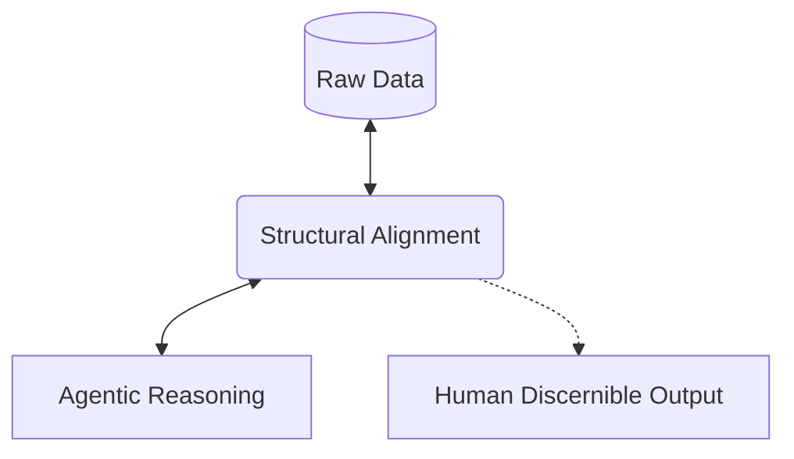

# Agentic Research

> **Agents as first class. Outputs as human discernible.**

Methodologies, tools, and implementations for high-order human-AI collaborative research.

## 📡 Mission

The primary objective is establishing **structural alignment** between raw data structures and agentic reasoning. By treating agents as primary users, the underlying operations are optimized for machine traversal, while the resulting insights remain clear, structured, and actionable for human review.

## 🛠 Projects

<b>
<a href="https://github.com/agentic-research/mache">🗂️ Mache</a>
</b>

**The Universal Graph-Native Overlay Engine**

Mache aligns structured data (JSON, YAML, Source Code) with OS primitives. It treats data not as text to be parsed, but as a Graph to be mounted.

* **Filesystem as Interface:** Traversal of complex logic trees using standard commands (`cd`, `ls`, `cat`).
* **SQL-Powered:** Graph querying and filesystem projection via SQL.
* **Write-Back Mode:** Surgical, identity-preserving updates to source code (AST-aware).
* **Context-Aware:** Virtual context files allow agents to understand global scope without full repository ingestion.

<b>
<a href="https://github.com/agentic-research/ley-line">⚡ Leyline</a>
</b>

**High-Performance Agent Transport & Integrity Layer**

If Mache is the filesystem, Leyline is the nervous system. Written in Rust, Leyline is the underlying infrastructure that exposes Agent-Computer Interfaces securely and efficiently.

* **Unix Domain Sockets:** Exposes the virtual filesystem via high-speed IPC, bypassing network overhead for local agent swarms.
* **Data Integrity:** Utilizes advanced FS/Unix primitives and Fountain Codes (RaptorQ) to ensure zero data corruption during high-throughput agent state syncs.
* **Custom Memory Arena:** Built to bypass kernel overhead, allowing agents to read and write to the Mache graph at blistering speeds.

*(Note: Leyline is currently core infrastructure and is closed-source.)*

<b>
<a href="https://github.com/agentic-research/x-ray">🩻 X-Ray</a>
</b>

**Voice-Driven Browser Agent OS**

X-Ray applies the principle of structural alignment to the live web. It projects chaotic, dynamic web pages (SPAs, Shadow DOMs, Canvas) into a deterministic semantic filesystem for agents to navigate, proving that *topology is the missing half of semantics*.

* **Topology over HTML:** Uses multimodal vision (The Cartographer) to map visual layouts into a deterministic VFS, eliminating the need for agents to guess CSS selectors or parse minified HTML.
* **Talker/Doer Swarm:** Decouples voice conversation (always listening) from background execution (POSIX traversal), ensuring fluid, real-time UX without awkward execution silences.
* **Canvas Blindspot Detection:** Employs pure-Go edge detection to identify and interact with UI regions inside opaque `<canvas>` or WebGL elements.
* **Powered by Mache:** Utilizes the Mache engine to let agents browse the web using standard filesystem commands (`ls`, `cat`, `act`).

*(Note: Developed for the Gemini Live Agent Challenge. Source code is currently closed/private.)*

## 🔬 Focus Areas

* **AST-Native Developer Tools:** Making source code navigable for agents via Tree-sitter.
* **Topology Schemas:** Formalizing the mapping between graph data and tree-based filesystems.
* **Agentic Research Template (ART):** Standardizing the structure of automated research workflows.
