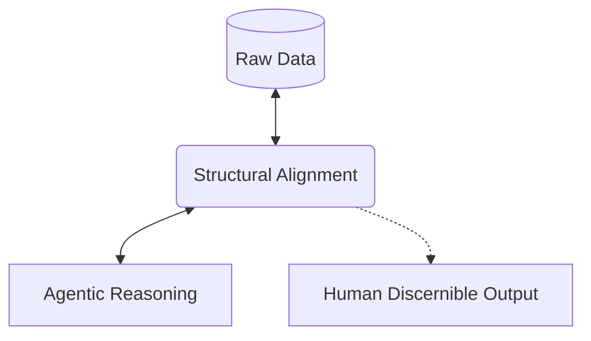

# Agentic Research

> **Agents as first class. Outputs as human discernible.**

Methodologies, tools, and implementations for high-order human-AI collaborative research.

## 📡 Mission

The primary objective is establishing **structural alignment** between raw data structures and agentic reasoning. By treating agents as primary users, the underlying operations are optimized for machine traversal, while the resulting insights remain clear, structured, and actionable for human review.

## 🛠 Projects

<b>
<a href="https://github.com/agentic-research/mache">Mache 🗂️</a>
</b>

**The Universal Graph-Native Overlay Engine**

Mache aligns structured data (JSON, YAML, Source Code) with OS primitives. It treats data not as text to be parsed, but as a Graph to be mounted.

* **Filesystem as Interface:** Traversal of complex logic trees using standard commands (`cd`, `ls`, `cat`).
* **SQL-Powered:** Graph querying and filesystem projection via SQL.
* **Write-Back Mode:** Surgical, identity-preserving updates to source code (AST-aware).
* **Context-Aware:** Virtual context files allow agents to understand global scope without full repository ingestion.

## 🔬 Focus Areas

* **AST-Native Developer Tools:** Making source code navigable for agents via Tree-sitter.
* **Topology Schemas:** Formalizing the mapping between graph data and tree-based filesystems.
* **Agentic Research Template (ART):** Standardizing the structure of automated research workflows.

