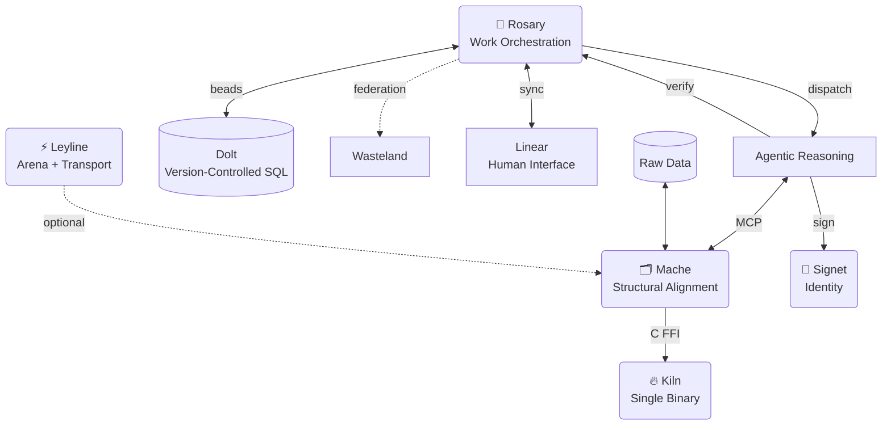

# Agentic Research

> **Agents as first class. Outputs as human discernible.**

Methodologies, tools, and implementations for high-order human-AI collaborative research.

```mermaid
graph TD
    Rosary(📿 Rosary<br/>Work Orchestration)
    Rosary -->|dispatch| Agent[Agentic Reasoning]
    Rosary <-->|beads| Dolt[(Dolt<br/>Version-Controlled SQL)]
    Rosary -.->|federation| Wasteland[Wasteland]
    Rosary <-->|sync| Linear[Linear<br/>Human Interface]

    Agent <-->|MCP| Mache(🗂️ Mache<br/>Structural Alignment)
    Agent -->|sign| Signet(🪪 Signet<br/>Identity)
    Agent -->|verify| Rosary

    Data[(Raw Data)] <--> Mache
    Mache -->|C FFI| Kiln(🔥 Kiln<br/>Single Binary)

    Leyline(⚡ Leyline<br/>Arena + Transport) -.->|optional| Mache
```

## 📡 Mission

The primary objective is establishing **structural alignment** between raw data structures and agentic reasoning. By treating agents as primary users, the underlying operations are optimized for machine traversal, while the resulting insights remain clear, structured, and actionable for human review.

## 🛠 Projects

### Core Stack

<b>
<a href="https://github.com/agentic-research/mache">🗂️ Mache</a>
</b>

**The Universal Graph-Native Overlay Engine**

Mache aligns structured data (JSON, YAML, Source Code) with OS primitives. It treats data not as text to be parsed, but as a Graph to be mounted.

* **Filesystem as Interface:** Traversal of complex logic trees using standard commands (`cd`, `ls`, `cat`).
* **SQL-Powered:** Graph querying and filesystem projection via SQL.
* **Write-Back Mode:** Surgical, identity-preserving updates to source code (AST-aware).
* **MCP Server:** 15 tools for structural code intelligence — overview, definition lookup, caller/callee tracing, community detection, impact analysis, and more.

<b>
⚡ Leyline
</b>

**High-Performance Agent Transport & Integrity Layer**

If Mache is the filesystem, Leyline is the nervous system. Written in Rust, Leyline is the underlying infrastructure that exposes Agent-Computer Interfaces securely and efficiently.

* **Zero-Copy Memory Arena:** Custom mmap'd arenas bypass kernel overhead for memory-speed reads and writes.
* **Network Transport:** UDP + ChaCha20-Poly1305 encryption with RaptorQ fountain codes for zero-loss delivery.
* **Filesystem Presentation:** NFS (macOS) and FUSE (Linux) mounts from arena-backed SQLite.

*(Leyline is closed-source core infrastructure.)*

<b>
<a href="https://github.com/agentic-research/kiln">🔥 Kiln</a>
</b>

**Where You Fire a Mache**

Kiln packages Mache (Go) and Leyline (Rust) into a single fat binary or distroless OCI image. One command gives you a fully wired MCP server backed by Leyline's zero-copy arena.

* **Fat Binary:** Go statically links Leyline's Rust `.a` via CGO — 32MB, no runtime deps.
* **Streamable HTTP:** Default MCP transport on `:7532` with stateful sessions. Plug into Claude Code, Cursor, or any MCP client.
* **Distroless Images:** Reproducible OCI images via melange + apko (~15MB, no shell).
* **Homebrew:** `brew install agentic-research/tap/kiln && brew services start kiln`

<b>
<a href="https://github.com/agentic-research/rosary">📿 Rosary</a>
</b>

**Autonomous Work Orchestrator**

Rosary finds work across your repos, dispatches AI agents to do it, and verifies the results. It scans for open issues (stored as "beads" in each repo's local Dolt database), triages by priority, dispatches Claude/Gemini agents in isolated worktrees, and runs a multi-tier verification pipeline.

* **Cross-Repo Coordination:** Tracks work across multiple repos via external refs — "threads" that string beads together into "decades" (ADR-level groupings).
* **MCP Server:** 24+ tools over stdio and Streamable HTTP — bead management, dispatch, pipelines, workspaces, and BDR hierarchy.
* **Agent Pipeline:** Configurable issue_type → agent sequence (e.g. bug → dev-agent → staging-agent). Handoffs are chain-hashed for tamper-evident audit trails.
* **Selective Field Encryption:** The `rosary-crypto` crate encrypts private fields (ChaCha20-Poly1305) while leaving public metadata in cleartext, enabling safe federation.
* **Wasteland Federation:** Publishes public beads to the [Wasteland](https://github.com/steveyegge/gastown) wanted board — the distributed work marketplace for agentic rigs.

<b>
<a href="https://github.com/agentic-research/x-ray">🩻 X-Ray</a>
</b>

**Voice-Driven Browser Agent OS**

X-Ray applies the principle of structural alignment to the live web. It projects chaotic, dynamic web pages (SPAs, Shadow DOMs, Canvas) into a deterministic semantic filesystem for agents to navigate, proving that *topology is the missing half of semantics*.

* **Topology over HTML:** Uses multimodal vision (The Cartographer) to map visual layouts into a deterministic VFS, eliminating the need for agents to guess CSS selectors or parse minified HTML.
* **Talker/Doer Swarm:** Decouples voice conversation (always listening) from background execution (POSIX traversal), ensuring fluid, real-time UX without awkward execution silences.
* **Canvas Blindspot Detection:** Employs pure-Go edge detection to identify and interact with UI regions inside opaque `<canvas>` or WebGL elements.
* **Powered by Mache:** Utilizes the Mache engine to let agents browse the web using standard filesystem commands (`ls`, `cat`, `act`).

*(Developed for the Gemini Live Agent Challenge.)*

### Identity & Cryptography

<b>
<a href="https://github.com/agentic-research/signet">🪪 Signet</a>
</b>

**Offline-First Proof-of-Possession Identity**

Replaces bearer tokens with cryptographic proof-of-possession. Ephemeral X.509 certificates, Ed25519 + ML-DSA-44 (post-quantum), OS keyring storage.

* **Git Commit Signing:** OpenSSL-compatible CMS/PKCS#7, 5-minute ephemeral certs.
* **HTTP Auth Middleware:** Two-step verification for Go servers.
* **Offline Operation:** No network required — keys live in macOS Keychain or `~/.signet/`.

<b>
<a href="https://github.com/agentic-research/go-cms">🛡️ go-cms</a>
</b>

**Modern CMS/PKCS#7 for Go**

A Go library for CMS (Cryptographic Message Syntax) / PKCS#7 messages with Ed25519 support. Used by Signet for signing operations.

<b>
<a href="https://github.com/agentic-research/go-platform-signers">🔐 go-platform-signers</a>
</b>

**Platform-Native `crypto.Signer` Implementations**

Hardware-backed signing via cgo — macOS Keychain, Linux PKCS#11. Provides `crypto.Signer` interface for platform-native key storage.

### Supply Chain & Vulnerability

<b>
<a href="https://github.com/agentic-research/venturi">🌪️ Venturi</a>
</b>

**High-Velocity Vulnerability Ingestion**

Concurrent Go pipelines that aggregate vulnerability data from NVD, GHSA, Wolfi, and other providers. Accelerates provider ingestion for downstream analysis.

<b>
<a href="https://github.com/agentic-research/smelt">⚗️ Smelt</a>
</b>

**Vulnerability DB Comparison & Validation**

Compare and validate grype-compatible vulnerability databases. Useful for verifying scanner output and cross-referencing findings.

## 🌐 Hosted Services

| Subdomain | Service | Status |
| --- | --- | --- |
| [`rosary.bot`](https://rosary.bot) | Hosted rosary — agent dispatch + bead management | Coming soon |
| [`mcp.rosary.bot`](https://mcp.rosary.bot) | Rosary MCP endpoint (Streamable HTTP) | Coming soon |
| [`mache.rosary.bot`](https://mache.rosary.bot) | Hosted mache MCP — structural code intelligence | Coming soon |
| [`auth.rosary.bot`](https://auth.rosary.bot) | Signet identity service — proof-of-possession auth | Coming soon |

## 🔬 Focus Areas

* **AST-Native Developer Tools:** Making source code navigable for agents via Tree-sitter.
* **Topology Schemas:** Formalizing the mapping between graph data and tree-based filesystems.
* **Agentic Research Template (ART):** Standardizing the structure of automated research workflows.
* **Supply Chain Security:** Vulnerability ingestion, validation, and exposure analysis.
